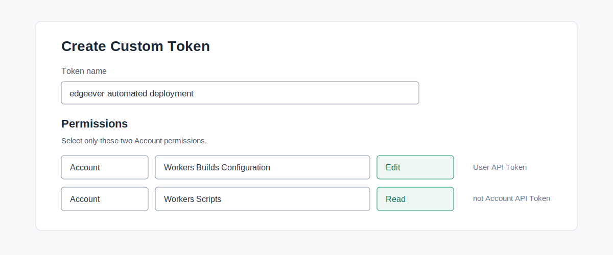

# Cloudflare Workers Builds 自动部署

Cloudflare Workers Builds 会在 `main` 发生变化时自动部署 EdgeEver，包括 GitHub **Sync fork** 带来的更新。本地 `bun run deploy` 只用于首次安装和紧急修复。

## 配置

先完成[首次部署](manual-deploy.zh-CN.md)，然后执行：

```sh
bun run deploy:builds:setup
```

命令会读取仓库 remote 与 `.env.local`、配置自动构建，并在首次配置时启动一次验证构建。实例配置发生变化后可以安全重跑。

只有命令明确提示时，才需要完成下面对应的操作。

### GitHub 授权

为 Fork 安装并授权 **Cloudflare Workers & Pages** GitHub App。这只是应用名称，EdgeEver 实例不需要部署 Pages 项目。授权完成后，命令会继续配置仓库连接。

### 配置 API token

如果缺少 `EDGE_EVER_BUILDS_API_TOKEN`，请在 [My Profile -> API Tokens](https://dash.cloudflare.com/profile/api-tokens) 创建自定义 **User API Token**，权限为：

- **Account** -> **Workers Builds Configuration** -> **Edit**
- **Account** -> **Workers Scripts** -> **Read**

不要使用 Account API Token 或现成模板。将 token 限制到对应账号，然后把 Cloudflare 仅显示一次的值保存到 `.env.local`：

```text
EDGE_EVER_BUILDS_API_TOKEN=<token>
```

不要提交或分享该 token。



### 部署 API token

如果命令提示没有可用的部署 API token，请打开 **Worker** -> **Settings** -> **Builds** -> **API token**，创建或选择一个能够部署 Worker 并更新 D1、R2 的 API token，然后重试。存在多个候选时，直接在终端中按名称选择。

## 更新与排错

配置完成后，只需推送到 `main` 或使用 GitHub **Sync fork**。Cloudflare 会安装依赖、检查并构建应用、执行新的 D1 migration，然后部署 Worker；不需要 GitHub Actions Secrets 或本地重新部署。

构建失败时，在 Worker 的 **Deployments** 页面查看日志。实例配置变化后，重新执行 `bun run deploy:builds:setup`。
